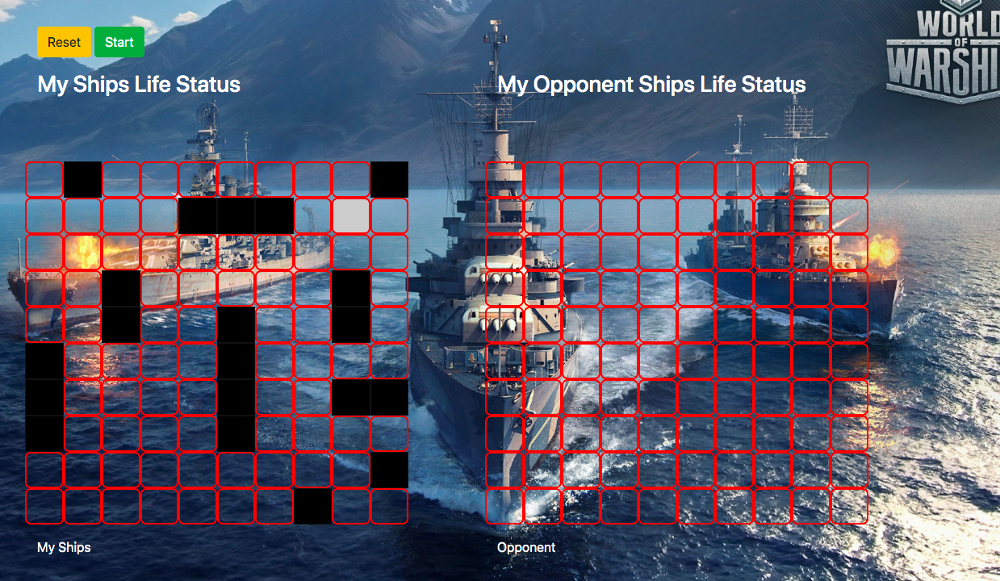

<h1 align=center> **Battleship Game** </h1>

[](https://github.com/RichardLitt/standard-readme)
[](https://david-dm.org/dwyl/esta)
This is a Test Driven Development of the battleship game
This project is designed with a Javascript(ES6) to emulate  a battleship game. 




## Background

- HTML
- CSS
- Javascript
- webpack
- Jest

## Demo
 Check out the live demo of the project. [Click](https://peaceful-cori-39aa5a.netlify.app/build/index.html)

## Usage
> Clone the repository to your local machine

```sh
$ git clone https://github.com/macbright/battleShip.git
```

> cd into the directory

```sh
$ cd battleship
```

`npm install` 
<br /> to install all the dependencies that are needed

`npm start` <br/> to start the local server which will open a new tap on your default browser 


## Maintainers 

Okike Bright – [@b_okike](https://twitter.com/b_okike) – brightokike@gmail.com

[https://github.com/macbright/github-link](https://github.com/macbright)

Boakye Addo Forison – addoboakyeforison@gmail.com

[https://github.com/Forison](https://github.com/Forison)


## Contributing

1. Fork it https://github.com/macbright/battleShip.git/fork)
2. Create your feature branch (git checkout -b feature/[choose-a-name])
3. Commit your changes (git commit -am 'What this commit will fix/add')
4. Push to the branch (git push origin feature/[chosen name])
5. Create a new Pull Request

## Future Features
1. include different levels of difficulties.

2. add a sound effect to the game

## License

The JavaScript Templates script is released under the
[MIT license](https://opensource.org/licenses/MIT).